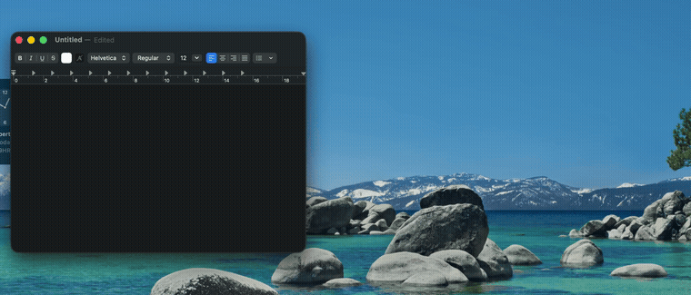
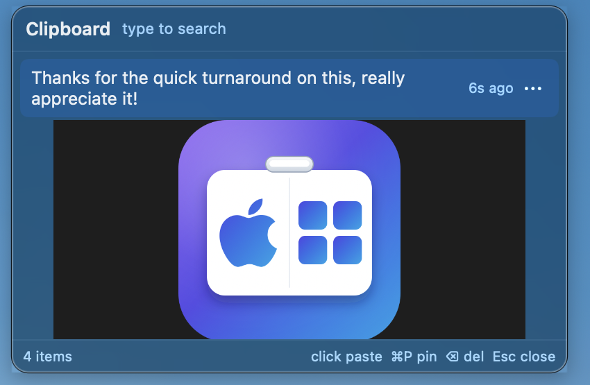

# No BS, Free Clipboard Manager — Nobody Should Be Paying for a Clipboard Manager

**Windows V** brings the Windows `Win+V` clipboard history experience to macOS. Hit a hotkey, see everything you've recently copied, click to paste. That's it. No subscription, no account, no cloud sync you didn't ask for, no ads. Local, offline, open source.





## Why

Every "clipboard manager" on the App Store wants $2.99/month for a feature Windows has shipped for free since 2018. This one's free, forever, and you can read every line of code that touches your clipboard.

## Features

- **Hotkey** `Cmd+Shift+V` opens the overlay anywhere; `Enter` or click pastes into whatever app you were just in
- **Search** just start typing to filter history
- **Text, RTF, and images** — captured, thumbnailed, and pasted with formatting intact
- **Pin** items you don't want to lose (`⌘P`), delete the ones you do (`⌫`)
- **Retention controls** — unlimited, capped, or time-based (24h / 1 week) — your call
- **Keyboard-first** — `↑`/`↓` to navigate, `Enter` to paste, `Esc` to close
- **100% local** — history lives in a SQLite database in `~/Library/Application Support/ClipboardManager/`; nothing ever leaves your Mac
- **Menu bar only** — no Dock icon, no clutter

## Install

Grab the latest `.dmg` from [Releases](../../releases), drag Windows V into `/Applications`, launch it.

Since this is an independent, non-notarized build (no $99/year Apple Developer Program membership here — see [Why](#why)), Gatekeeper will complain the first time:

1. Try to open it. macOS will block it and say it's from an unidentified developer.
2. Go to **System Settings → Privacy & Security**, scroll down, click **Open Anyway**.
3. Still stuck? Run this once in Terminal: `xattr -cr "/Applications/Windows V.app"`, then open it again.

On first paste, macOS will ask for **Accessibility** permission — that's required to simulate `Cmd+V` into whatever app you're pasting into. Grant it and you're set.

## Build from source

```bash
open ClipboardManager.xcodeproj
# Cmd+R — it only appears in the menu bar. Grant Accessibility when prompted.
```

Requires Xcode 15+, macOS 13+, Swift 5. `SQLite.swift` resolves automatically via Swift Package Manager.

## Distribution toolchain

A `Makefile` drives the full build → sign → package → notarize pipeline:

```bash
make build       # Release build -> dist/Windows V.app (ad-hoc signed)
make package      # dist/WindowsV-<version>.zip + .dmg
make notarize     # Apple notary + staple (needs your own Developer ID credentials)
make release      # package + notarize
make version      # bump patch, or: make version VERSION=1.1.0
make icon         # regenerate AppIcon + .icns from icon/AppIcon.svg (needs librsvg)
make clean
```

Ad-hoc builds (the default) run fine locally but trigger Gatekeeper on other machines — see [Install](#install). If you have a paid Apple Developer account, you can produce a fully notarized, Gatekeeper-clean build:

```bash
make release IDENTITY="Developer ID Application: Your Name (TEAMID)" \
  KEYCHAIN_PROFILE=WindowsV
```

## How it works

| | |
|---|---|
| **Hotkey** | Carbon `RegisterEventHotKey` for `Cmd+Shift+V`, works system-wide |
| **Paste** | `CGEvent`-synthesized `Cmd+V` into the previously-focused app (requires Accessibility) |
| **Capture** | Polls `NSPasteboard.general.changeCount` every 0.4s; dedupes consecutive copies |
| **Storage** | SQLite (WAL mode) for metadata + PNGs on disk for images; both local-only |
| **Retention** | Unlimited / capped (100 items, 2MB, downscaled to 1600px) / 24h / 1 week — pinned items are never pruned |
| **UI** | `MenuBarExtra` + a borderless `NSPanel` overlay, `LSUIElement` (no Dock icon) |

## Project layout

```
ClipboardManager/
├── App/        ClipboardManagerApp.swift (MenuBarExtra) / AppDelegate.swift
├── Core/       ClipboardMonitor / HistoryStore / HotkeyService / PasteService / AppSupport
├── Models/     ClipboardItem.swift (ClipboardKind, RetentionMode)
├── UI/         OverlayWindow (NSPanel) / OverlayView / RowViews / SettingsView
└── Resources/  Info.plist (LSUIElement) / entitlements (no sandbox — CGEvent needs it)
icon/           AppIcon.svg (master) + generate_icon.sh + WindowsV.icns
scripts/        build.sh / package.sh / notarize.sh / version.sh / lib.sh
Makefile        target orchestrator
```

## Not built (yet)

File copies, HTML/RTF fidelity beyond basic RTF, OCR, iCloud sync, per-app blocklist. PRs welcome.

## License

[GPL-3.0](LICENSE). Use it, fork it, ship your own build — just keep it open.
